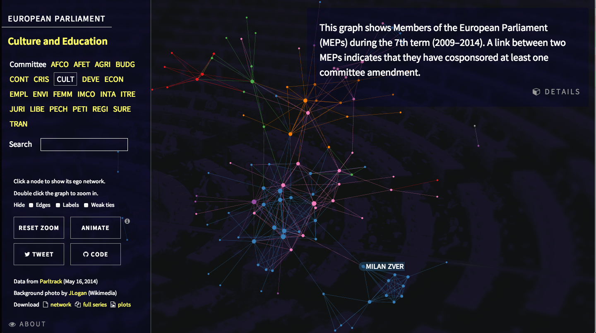

R code to build amendment [cosponsorship networks](http://jhfowler.ucsd.edu/cosponsorship.htm) from [Parltrack data dumps](http://parltrack.euwiki.org/dumps/).

> View an [interactive visualization][demo] or [all network plots](http://briatte.org/epam/plots.html)

[][demo]

[demo]: http://briatte.org/epam/
