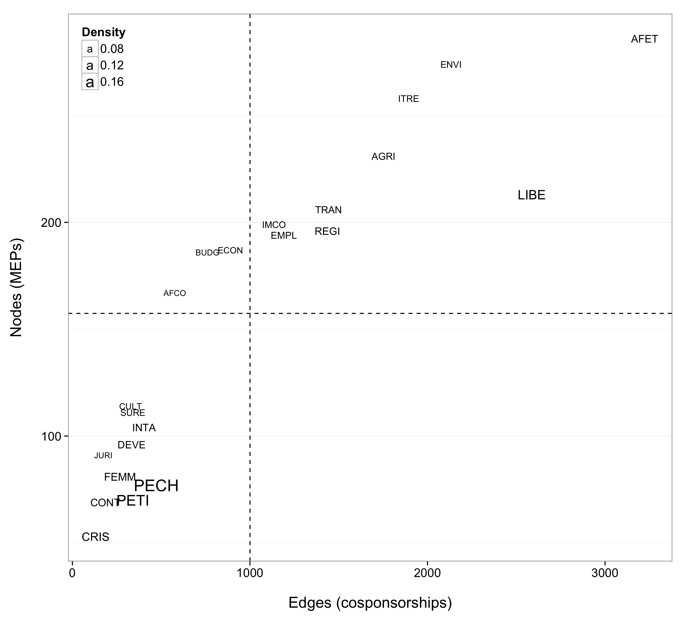

# How collaborative are Members of the European Parliament?

Is the [European Parliament][ep] a consensual or polarized legislature? Are Members of the European Parliament (MEPs) more or less collaborative than members of national parliaments, and how well do they align with the left-right cleavage that characterizes party politics in virtually every Member State?

These questions are important because a consensual legislature means that the Commission or the Council can easily get a majority of MEPs to agree with their proposals, whereas a more polarized parliament might become a stronger veto player in the legislative process of the European Union.

So far, these questions have been answered mostly on the basis of [roll call votes][votewatch], which point to [increased left-right politicization among MEPs][hix-et-al]. However, roll call votes are only one of many dimensions of lawmaking. Furthermore, these votes are sensitive to [at least one form of bias][rcv] that should encourage us to also look at alternative measures of party polarization.

## Amendment cosponsorship in EP committees

Since the research literature seems to agree that the most important part of lawmaking in the European Parliament (EP) happens — as in the U.S. Congress — in its [committees][ep-committees], these might be a good starting point to measure the extent of collaboration that effectively takes place between MEPs from different EP party groups, defined as broad party families ranging from the far left to the extreme right.

To that end, I downloaded EP amendment data from [Parltrack][parltrack] and built [cosponsorship networks][fowler] for 22 out of the 25 EP committees active during the 7th EP term, between 2009 and 2014. In these networks, an undirected tie exists between two MEPs if they have cosponsored at least one amendment together.

The screenshots below are from an [interactive visualization][epam] that shows the overall network topology of each committee, as well as the egocentric network of each MEP. Each node represents an MEP, colored by broad party group and sized proportionally to her [network centrality](http://toreopsahl.com/tnet/weighted-networks/node-centrality/) — one of many possible measures of influence in a relational environment.

[][epam]

[][epam-sure]

## So what might we observe at that stage?

A cursory look at the entire collection of networks indicates that yes, MEPs do tend to behave like members of national parliaments: most collaboration occurs between members of the same party, and collaboration between party groups is more frequent when these groups are situated on the same side of the left-right spectrum.

These patterns depend partly on the number of committee members and the frequency of cosponsorship between them. Both dimensions appear in the figure below, where every acronym is an EP committee, sized proportionally to the [density][density] of its network.

In the plot above, the smallest and sparsest networks are displayed at the bottom left, whereas the largest and densest EP committees are shown in the top right quadrant, above the average number of nodes and edges marked by dashed lines.

The plot also reveals that only few of all elected MEPs are active participants in the committee amendment process: extreme-right MEPs, for instance, did not have access to committees during the observed period, because there were [not enough of them][tmc-mudde] to form an EP party group at the time.

## A measure of divisiveness among MEPs

Moving on to the degree of collaborativeness between MEPs, the next figure shows [modularity][modularity], a network measure that basically assesses whether a partitioning variable, like party affiliation, does a good job at dividing a graph into distinct communities. This measure has been used as a proxy for party polarization in several studies of the U.S. Congress, using [more complex research designs][kirkland-prq] than this exploratory note.

Two measures of modularity are displayed below: the _empirical_ score of each committee is calculated against its party groups, while the _maximized_ score (shown as grey dots) is the algorithmically computed maximum modularity that might be reached in the network, given its edge structure. The dashed and dotted lines respectively mark average empirical and maximized modularity.

The plot above also shows the ratio of empirical to maximized modularity, from blue (low) to red (high). By that measure, some committees like Fisheries and Petitions express very low polarization, while others, like Foreign Affairs ([AFET][ep-afet]) or Development ([DEVE][ep-deve]), are more divided. (It seems reasonable to ignore the [SURE][ep-sure] and [CRIS][ep-cris] committees here: both had a short lifespan, and their networks are excessively sparse).

## Do these scores indicate high or low polarization?

The measures reported above are only rough estimates, and I could not get my hands on amendments from earlier legislatures to assess possible variations in time. However, since modularity is bounded between –1 and +1, it is possible to compare these scores with those from other legislatures.

In the U.S. Congress, measures of party polarization are [generally][modularity] higher than those observed here. But Congress is a bipartisan legislature, which might severely flaw the comparison. For a more reliable comparison, it might be a better idea to compare the EP to the parliament of a multi-party system.

As part of a larger study, I computed network modularity [in the French Parliament][neta-slides], using all available cosponsored amendments and bills (the earlier data date back to 1986). A quick comparison of scores shows, again, that the EP is less polarized than the [French National Assembly or Senate][neta-mod].

All in all, the EP does therefore seem to be a more consensual legislature than national parliaments. This, however, might be more strongly related to its committee structure rather than to how left-right party/group coalitions are managed at the level of the European Union.

## What might we finally make of all this?

A few months ago, _The Monkey Cage_ ran a very interesting series of posts on [political polarization][tmc-pol], in which David W. Brady [observed][tmc-brady] that European legislatures are, quite like the U.S. Congress, highly polarized legislative arenas. My measures in the EP and in France both tend to confirm this state of affairs, although I have no data to back his claim that

> "There may be headlines in Italy and France about dysfunctional government, but [people] don't blame it on polarized political parties.".

The evidence also lends some support to the idea that the amount of collaboration taking place in each EP committee is sensitive both to [chamber size][kirkland-size] and, perhaps more importantly, to the policies under examination. From that perspective, it is unsurprising to find out that fisheries, for example, do not result in high party polarization in the corresponding EP committee.

Whether the amount of legislative collaboration between MEPs might change in the future is also an open question, because divisiveness is susceptible to change with the national (and linguistic) composition of the EP. Cross-national variations deeply affect [voter responsiveness][tmc-devries] among MEPs, so it seems legitimate to expect some of the same in other aspects of legislative behavior.

Last, it should be stressed that the results reported here are strictly exploratory. To correctly model the data, one would have to define an edge weighting scheme and then aim at estimating more precise network effects, such as (differential) [homophily][goodreau-et-al], from more sophisticated network graph models. I would gladly help anyone interested in conducting that kind of research.

* * *

[François Briatte](http://f.briatte.org/) is a PhD candidate at the Institute of Political Studies in Grenoble and an assistant lecturer at the [European School of Political Sciences](http://espol-lille.eu/) (ESPOL) in Lille.

<!-- links -->

[ep]: http://www.europarl.europa.eu/
[ep-committees]: http://www.europarl.europa.eu/committees/en/full-list.html
[ep-afet]: http://www.europarl.europa.eu/committees/en/afet/home.html
[ep-deve]: http://www.europarl.europa.eu/committees/en/deve/home.html
[ep-sure]: http://www.europarl.europa.eu/committees/en/sure/home.html
[ep-cris]: http://www.europarl.europa.eu/committees/en/cris/home.html
[epam]: http://briatte.org/epam/
[epam-sure]: http://briatte.org/epam/?co=SURE
[neta-slides]: http://f.briatte.org/research/slides-lawfactory2014/
[neta-mod]: http://f.briatte.org/research/slides-lawfactory2014/#7
[rcv]: http://nikoletayordanova.net/wp-content/uploads/Accepted_manuscript_EPSR.pdf
[hix-et-al]: https://encrypted.google.com/books/about/Democratic_politics_in_the_European_Parl.html?id=aSDg5RV5_w4C
[votewatch]: http://www.votewatch.eu/
[fowler]: http://jhfowler.ucsd.edu/cosponsorship.htm
[kirkland-prq]: http://jhkirkla.wordpress.com/2014/03/29/ideological-heterogeneity-and-legislative-polarization-in-the-united-states/
[kirkland-size]: http://jhkirkla.wordpress.com/2013/08/16/chamber-size-effects-on-the-collaborative-structure-of-legislatures/
[density]: https://en.wikipedia.org/wiki/Network_science#Density
[modularity]: http://people.maths.ox.ac.uk/porterm/papers/modularity_jop.pdf
[goodreau-et-al]: https://www.ncbi.nlm.nih.gov/pmc/articles/PMC2831261/
[parltrack]: http://parltrack.euwiki.org/
[tmc-pol]: http://www.washingtonpost.com/blogs/monkey-cage/wp/2014/01/07/want-to-know-more-about-political-polarization-the-monkey-cage-has-answers-and-questions/
[tmc-brady]: http://www.washingtonpost.com/blogs/monkey-cage/wp/2014/02/17/sure-congress-is-polarized-but-other-legislatures-are-more-so/
[tmc-mudde]: http://www.washingtonpost.com/blogs/monkey-cage/wp/2014/02/11/the-le-pen-wilders-alliance-and-the-european-parliament-plus-ca-change-plus-cest-la-meme/
[tmc-devries]: http://www.washingtonpost.com/blogs/monkey-cage/wp/2014/05/26/are-european-parliamentarians-responsive-to-their-voters/

<!-- XXX words -->
